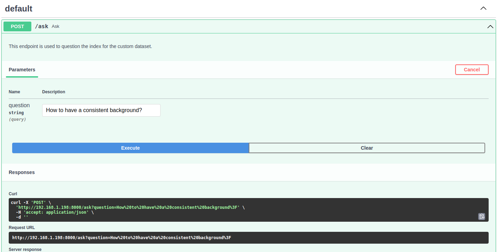
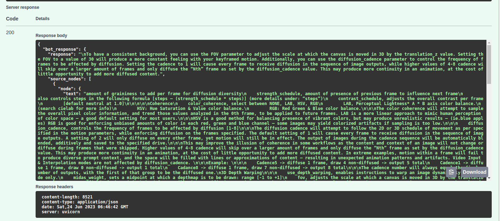

# Deforum Stable Diffusion Chatbot
Understanding or locating the correct configuration for deforum stable diffusion can be puzzling. As a solution, I opted to organize its documentation for easy searching. This application is a chatbot powered by OpenAI GPT and utilizes deforum stable diffusion to assist developers in effectively searching through documentations.

Feel free to to contribute to and expand its documentation.

<video src='./resource/video/download.mp4' width=180/>

## Getting started

```

cp .env.example .env

```

```

docker-compose up -d

```

## Testing
open FastApi swagger, hit try it out.



```
http://0.0.0.0:8086/docs
```


